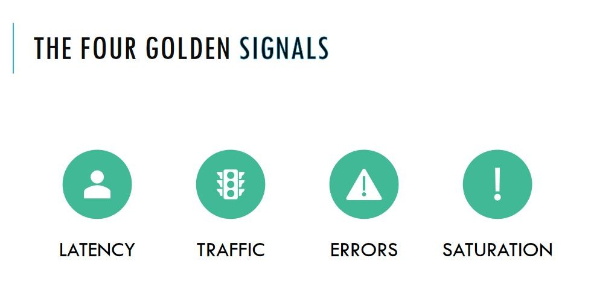

### to find DNS of autoscaling group, 
- click on load balancer on left panel of console.
- select your application load balancer (ALB). Scroll down and under description you will find DNS of your autoscaling group.
#

## Four golden signals for monitoring

 
- latency - Latency is the time it takes to send a request and receive a response. Latency is commonly measured from the server side but can also be measured from the client side to account for differences in network speed.

- traffic - Traffic is a measure of the number of requests flowing across the network. These may be HTTP requests to your web server or API, or messages sent to a processing queue. Times of peak traffic can result in additional stress on your infrastructure and may push it to the limit, triggering downstream effects
- Errors - Errors can tell you about misconfigurations in your infrastructure, bugs in your application code, or broken dependencies. For example, a spike in error rate could indicate the failure of a database or network outage
- Saturation - Saturation defines the load on your network and server resources. Every resource has a limit after which performance will degrade or become unavailable. 
