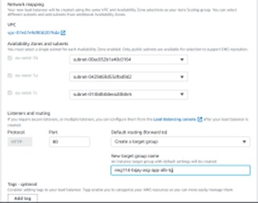

# DevOps 30/05/22
## What is DevOps?
- DevOps is a set of practices and cultural philosophy that removes the barriers between traditionally siloed teams that are the development and operations teams. Under a DevOps model, development and operations teams work together across the entire software application life cycle, from development and test through deployment to operations. 

- DevOps enabled developers and operations team to accelerate delivery through automation, collaboration, fast feedback and iterative improvement. It facilitates a culture of collaboration and share responsibility.

## Why DevOps? What are its benefits?
- Before DevOps, Development teams and operations team were working in silos so they blame each other whenver there is a problem. DevOps removes the barrier between the silos and help better understandings between the development team and operations team.

- Speed - DevOps practices let you move at the velocity you need to innovate faster, adapt to changing markets better, and become more efficient at driving business results
- Rapid delivery - When you increase the pace of releases, you can improve your product faster and build competitive advantage.
- Reliability - DevOps practices like continuous integration and continuous delivery can ensure the quality of application updates and infrastructure changes so you can reliably deliver at a more rapid pace while maintaining an optimum experience for end users.
- Improved collaboration - Under a DevOps model, developers and operations teams collaborate closely, share responsibilities, and combine their workflows. This reduces inefficiencies and saves time.
- Security - Adopt a DevOps model without sacrificing security by using automated, integrated security testing tools.

## Role of DevOps?
- DevOps has been created to bridge the gap between software development teams and IT operations. The DevOps Engineer serves an important role on each team and liaises between them
- A DevOps engineer is someone with a deep knowledge of the software development process and lifecycle and has expertise in the various automation tools for developing CI/CD pipelines.

- The DevOps engineer  works with developers and IT teams to monitor and facilitate code releases on a CI/CD basis.
- The DevOps Engineer work with internal customers, including QC personnel, software and application developers, project managers, project stakeholders

## What are the four pillars of DevOps?
- Robustness - By working together, the IT infrastructure are more robust as there is better collaboration.

- Flexibility - able to work across different programming language and cloud platforms
- Cost effective -faster release of software, less errors due to CI/CD, less manual work due to automation
- East of use - easy to apply DevOps to any work environment.

#
# What is development environment? 
- A development environment is a collection of procedures and tools for developing, testing and debugging an application or program. The development environment normally has three server tiers, called development, staging and production. All three tiers together are usually referred to as the DSP. 

- Development server - The development server is used to test the code and conduct application performance checks. Once successfully tested, the developer moves the application to the staging server.

- Staging server - The staging server looks exactly like the production server environment. Using a staging server enables developers to run tests on the staging server to ensure reliability and avert failure in an actual production server. Running tests on the staging server is usually the final step before deploying the application to a production server.

- Production(Live) server - A production server or live server is used to host website content and applications for deployment to a live environment. Once the application is approved, it becomes part of the production server.

## Why is it needed?
- The purpose of a development environment is to have a place for a developer to test anything they want without worrying about it affecting any end-users or content editors working on a live website.You should use a development environment if you want to make sure not to break anything on your live environments that your users see. By using a development environment for your website, you'll have a place to make all of the changes you want, without the users of your website will notice.

- Working with multiple environments and following a deployment process is great for streamlined workflows and for reducing potential errors. It also means that a developer can make breaking changes on the development environment and make sure everything works before deploying the changes to a live environment. A development environment is often hosted locally by the developer, but can also be hosted on a server.
 
- It might look like an unnecessary step to have more than a live environment, but even with very small projects, it's becoming the industry standard and a workflow that most developers prefer. And with the help of integrated development environments and powerful deployment technology, it rarely adds much extra development time. 

- On the contrary, it might help speed up the development process as the developer has more freedom during development, as they don't have to worry about breaking the site. This gets changes implemented faster and safer than if it all had to be done in a live environment.
#
# Linux commands
### List of linux commands:
- Establish an SSH session into Ubuntu `vagrant ssh`
- Update Ubuntu `sudo apt-get update -y`

- Upgrade Ubuntu `sudo apt-get upgrade -y`
- Install nginx `sudo apt-get install nginx -y`
- check nginx status `systemctl status nginx` or `start` or `stop` or `restart`
- creates and configures guest machines according
to your vagrantfile `vagrant up`
- destroy vagrantfile `vagrant destroy`
- exit out of nginx `exit`

 #sudo stands for superuser do and execute command as root privilege.
#
 ### Bash scripting:
 - create a file called provision.sh
 - change permission of file `chmod +x provision.sh`
 - First line MUST BE `#!/bin/bash
 - Update and upgrade
 - Installed nginx
 - Start nginx
 - `enable nginx`
 - stopped then started
 - To run our script `sudo ./provision.sh`
 #
 ## Configure Vagrant
 ### In the vagrantfile add these codes.
 - `Vagrant.configure("2") do |config|`
 
 - `config.vm.box = "ubuntu/xenial64" `
 - `#add a private network between localhost and VM using ip`
 - `config.vm.network "private_network", ip: "192.168.10.100" `
 - `#add ext script to run vagrant`
 - `config.vm.provision "shell", path: "./provision.sh", run: "always" `

 ### Sync app folder to virtualbox.
 - `# Synced app folder`
 - `# cp everything from current location create a folder called app - copy everything from localhost `
 - `config.vm.synced_folder ".", "/home/vagrant/app" `
 #
 ## Provisioning Vagrant
### In the VirtualBox:
### create a provision.sh file. Add this code in the file.
- `#!bin/bash `

- `#update sudo apt-get update -y`

- `#upgrade sudo apt-get upgrade -y`

- `#install nginx sudo apt-get install nginx`

- `#start nginx sudo systemctl start nginx`

- `#enable nginx sudo systemctl enable nginx`

### In the local host:
-  `gem install bundler`
-  `bundler`
- run `rake spec` . Test will fail first time.
- Install nodejs v6 using `sudo curl -sL https://deb.nodesource.com/setup_6.x | bash -`
- `sudo apt-get install nodejs -y`
- install `pm2`
- `rake spec` again to check if tests passed. Once all tests are passed, follow the next step below.
- open vagrantfile and add this code `config.vm.synced_folder ".", "/home/vagrant/app"` to sync app folder. This copy everything from current location create a folder called app - copy everything from localhost. Save the file

- Do `vagrant reload` after this

###  In the VirtualBox again:

-  `vagrant ssh` into VirtualBox
- `npm install`
- `npm start`
- Your app is now ready and listening on port 3000
enter :3000 after the host address 192.168.10.100

### To automate without SSH into VirtualBox
- In the your local folder, add these commands into the provision.sh file.

- `#download v6 curl -sL https://deb.nodesource.com/setup_6.x | sudo -E bash -`

- `#install nodejs sudo apt-get install nodejs -y`

- `#install pm2 sudo npm install pm2 -g`

- `#download python stuff sudo apt-get install python-software-properties`

- `#redirect to app folder cd /app/app/app/`

- `#npm install and d to detach npm install -d`

- `#start npm npm start`

- Do `vagrant reload`

- Enter your IP adress including port 3000 (192.168.10.100:3000) on your browser. You will now see the Spartan App page if it is working correctly.
#

## Reverse Proxy
- `location / {
    proxy_pass http://localhost:3000;
    proxy_http_version 1.1;
    proxy_set_header Upgrade $http_upgrade;
    proxy_set_header Connection 'upgrade';
    proxy_set_header Host $host;
    proxy_cache_bypass $http_upgrade;
}`
#
## What is Cloud computing
- Cloud computing is the on-demand delivery of IT resources over the Internet with pay-as-you-go pricing. Instead of buying, owning, and maintaining physical data centers and servers, you can access technology services, such as computing power, storage, and databases, on an as-needed basis from a cloud provider like Amazon Web Services (AWS).

- Types of cloud computing:
- Infrastructure as a Service (IaaS) - IaaS contains the basic building blocks for cloud IT. It typically provides access to networking features, computers (virtual or on dedicated hardware), and data storage space. IaaS gives you the highest level of flexibility and management control over your IT resources. It is most similar to the existing IT resources with which many IT departments and developers are familiar

- Platform as a Service (PaaS) - PaaS removes the need for you to manage underlying infrastructure (usually hardware and operating systems), and allows you to focus on the deployment and management of your applications. This helps you be more efficient as you don’t need to worry about resource procurement, capacity planning, software maintenance, patching, or any of the other undifferentiated heavy lifting involved in running your application. 

- Software as a Service (SaaS) - SaaS provides you with a complete product that is run and managed by the service provider. In most cases, people referring to SaaS are referring to end-user applications (such as web-based email). With a SaaS offering, you don’t have to think about how the service is maintained or how the underlying infrastructure is managed. You only need to think about how you will use that particular software. 

## Benefits of cloud computing

- Trade fixed expense for variable expense – Instead of having to invest heavily in data centers and servers before you know how you’re going to use them, you can pay only when you consume computing resources, and pay only for how much you consume.

- Benefit from massive economies of scale – By using cloud computing, you can achieve a lower variable cost than you can get on your own. Because usage from hundreds of thousands of customers is aggregated in the cloud, providers such as AWS can achieve higher economies of scale, which translates into lower pay as-you-go prices.

- Stop guessing capacity – Eliminate guessing on your infrastructure capacity needs. When you make a capacity decision prior to deploying an application, you often end up either sitting on expensive idle resources or dealing with limited capacity. With cloud computing, these problems go away. You can access as much or as little capacity as you need, and scale up and down as required with only a few minutes’ notice.

- Increase speed and agility – In a cloud computing environment, new IT resources are only a click away, which means that you reduce the time to make those resources available to your developers from weeks to just minutes. This results in a dramatic increase in agility for the organization, since the cost and time it takes to experiment and develop is significantly lower.

- Stop spending money running and maintaining data centers – Focus on projects that differentiate your business, not the infrastructure. Cloud computing lets you focus on your own customers, rather than on the heavy lifting of racking, stacking, and powering servers.

- Go global in minutes – Easily deploy your application in multiple regions around the world with just a few clicks. This means you can provide lower latency and a better experience for your customers at minimal cost.

## How does cloud computing fit into DevOps?

- DevOps automation is becoming cloud-centric. Most public and private cloud computing providers support DevOps systemically on their platform, including continuous integration and continuous development tools. This tight integration lowers the cost associated with on-premises DevOps automation technology, and provides centralized governance and control for a sound DevOps process. Many developers who enter into the process find that governance keeps them out of trouble, and it's easier to control this centrally via the cloud versus attempting to bring departments under control.

- Cloud-based DevOps lessens the need to account for resources leveraged. Clouds leverage usage-based accounting, which tracks the use of resources by application, developer, user, data, etc. Traditional systems typically don't provide this service. When leveraging cloud-based resources, it's much easier to track costs of development resources and make adjustment as needed.
#
## What is AWS?
- Amazon Web Services (AWS) is the world’s most comprehensive and broadly adopted cloud platform, offering over 200 fully featured services from data centers globally. - Millions of customers—including the fastest-growing startups, largest enterprises, and leading government agencies—are using AWS to lower costs, become more agile, and innovate faster.

### AWS best practices - naming convention
- eng114_yourname_app
- eng114_yourname_db
eng114_yourname_bastion

## Two tier architecture in AWS

- 

## AWS Services(EC2)

- On the AWS console, choose EC2

### creating EC2 instances 

- Before using EC2, plan, design, develop

- click launch instances (not from template)

- choose OS - Ubuntu 18.04

- choose t2.micro

- add storage

- choose network (VPC, subnets)

- add tags

- add security group

- review and launch
- 
- to automate running your python script, you can add it in user data under step 3 - configuring instance.

### creating AMIs

- select AMI from the left panel of console

- lauch instance from  AMI

- follow similar steps to creating instance
- create AMI

### User data script for automation
- Script for app instance
- #!/bin/bash

- #Update and upgrade 
`sudo apt-get update -y`
`sudo apt-get upgrade -y`

- #Install nginx
`sudo apt-get install nginx -y`
`sudo systemctl start nginx`
`sudo systemctl enable nginx`

- #Install nodejs and npm
`curl -sL https://deb.nodesource.com/setup_6.x | sudo -E bash -`
`sudo apt-get install nodejs -y`
`sudo apt-get install npm `
`sudo npm install pm2 -g`
`sudo apt-get install python-software-properties -y`

- #Copy data from GitHub repo to AWS
`mkdir repo`
`cd repo`
`git clone https://github.com/BA-cybersec/eng114_devops.git`
`cd eng114_devops/`

- #Copy default file to allow to forward from port 3000 to port 80 
`sudo mv default /etc/nginx/sites-available/default` 

- #Restart nginx
`sudo systemctl restart nginx`

- #Make environment variable DB_HOST so that our app can connect to the database through port 27017
`sudo echo "export DB_HOST='mongodb://3.250.139.104:27017/posts'" >> /etc/bash.bashrc`
`source /etc/bash.bashrc`

- ##install npm
`sudo apt npm install`

#
## Amazon S3
- can store any type of data
- No data limit
- highly available
- global service
- scalable
- Storage class:
- Standard - frequent access. Data readily accessible.
- Glacier - infrequent access. Takes time to access data. For archiving data
## How to configure into aws
- `aws configure`
- enter access key
- enter sercet key
- enter region `eu-west-1`
- enter language `json`
## Install aws command line
- `sudo pip3 install awscli`
## install python 3.7
- `sudo apt-get update`
- `sudo apt-get install build-essential libpq-dev libssl-dev openssl libffi-dev zlib1g-dev`
- `sudo apt-get install python3-pip python3.7-dev`
- `sudo apt-get install python3.7`
- if getting error, do this
- `sudo apt-get install -y software-properties-common`
- `sudo add-apt-repository ppa:deadsnakes/ppa`
- `sudo apt-get update`
- `sudo apt-get install python3-pip python3.7-dev`
- `sudo apt-get install python3.7`
- `sudo update-alternatives --install /usr/bin/python3 python3 /usr/bin/python3.7 2`
- `sudo update-alternatives --config python3`
- If getting dkpg error
- sudo apt update
- sudo apt upgrade
- sudo apt install python3.7
- do alias python=python3
- If getting boto3 no moduleerror:
- do pip uninstall boto3
- sudo pip install --target=/usr/lib/python3.6/dist-packages boto3
## install boto3
- `pip install boto3`
## Create bucket
- `import boto3`

`s3 = boto3.client('s3')`

`s3.create_bucket(Bucket='eng114-bijay-bucket', CreateBucketConfiguration={`

    `'LocationConstraint': 'eu-west-1'})`
## upload file to s3 bucket
- `import boto3`

`s3 = boto3.client('s3')`

`s3.upload_file(`
`Filename = 'test1.txt',`
`Bucket = 'eng114-bijay-bucket',`
`Key = 'test1.txt'
`)`

## download file from s3 bucket
- `import boto3`

`s3 = boto3.client("s3")`

`s3.download_file(`

    `Bucket="eng114-bijay-bucket", Key="test1.txt", Filename="test1.txt"`
## delete file from s3 bucket
- `import boto3`

`s3 = boto3.resource('s3')`

`s3.Object('eng114-bijay-bucket', 'test1.txt').delete()`

## delete s3 bucket
- `import boto3`

`s3 = boto3.client("s3")`

`bucket_name = "eng114-bijay-bucket"`

`client.delete_bucket(Bucket=bucket_name)`
#

# Monitoring and alert management

- Questions to ask -
- What should we monitor?
- When should we monitor?
- Who should be responsible?
- What should be the next steps?
- Why should we monitor?
- What aspects shoulf we monitor?
- error logs
- budgeting
- uptime-access time-response time
- security breaches
- system tests/health
- instance's health
- CPU utilisation
#
## CloudWatch for monitoring and its use with other AWS services:

- Amazon CloudWatch monitors your Amazon Web Services (AWS) resources and the applications you run on AWS in real time. You can use CloudWatch to collect and track metrics, which are variables you can measure for your resources and applications.

- The CloudWatch home page automatically displays metrics about every AWS service you use. You can additionally create custom dashboards to display metrics about your custom applications, and display custom collections of metrics that you choose.

- You can create alarms that watch metrics and send notifications or automatically make changes to the resources you are monitoring when a threshold is breached.
#

### Amazon SNS to send notification or alarms to customers:

- Amazon Simple Notification Service (Amazon SNS) is a managed service that provides message delivery from publishers to subscribers. Publishers communicate asynchronously with subscribers by sending messages to a topic, which is a logical access point and communication channel. 

- Clients can subscribe to the SNS topic and receive published messages using a supported endpoint type, such as Amazon Kinesis Data Firehose, Amazon SQS, AWS Lambda, HTTP, email, mobile push notifications, and mobile text messages (SMS).

#
## Setup for monitoring and alert management:

- Enable detailed monitoring 

### create alarm

- create alarm in CloudWatch
- select metrics -> EC2 -> per instance metrics
- select percentage 50
- create dashboard

- go to simple notification service (sns)
### create topic
- type standard
- Name your topic
- then click on create topic
### create subscription
- choose topic you want to use
- choose protocol - email
- choose endpoint - subscribe using your email
- then create subscription

## Autoscaling and load balancing

### Application Load Balancer

- Autoscaling automatically adjusts the amount of computational rescources based on the server load

- Load Balancing distributes traffic between EC2 instances so that no one instance gets overwhelmed
- Launch template
- Type of LB -ALB Application Load Balancer: target group/listener group HTTP
- ALB -attach required dependencies
- Auto scaling group - attach this to ALB
### Create launch template for use auto scaling group

- click on launch template under instances on left panel of console

- click on create launch template
- name your template
- check box for provide autoscaling guidance
- Add tags under template tags: Key = Name, Value = eng114-name-asg-lt
- Choose Ubuntu 18.04 as amis
- Instance type as t2.micro
- choose key pair
- Choose subnets - eu-west-1a, 1b and 1c
- choose app security group
- add script in user data if needed for example
- `sudo apt-get update`
- `sudo apt-get upgrade`
- `sudo apt-get install nginx`
- `sudo systemctl start nginx`
- `sudo systemctl enable nginx`
- click again on create launch template
### Auto scaling group

- create auto scaling group
- Name your auto scaling group
- choose your launch template
- Choose availability zone and subnets - eu-west-1a, 1b and 1c
- attach load balancer
- type as application load balancer 
- name load balancer
- load balancer scheme - internet facing
- create target group 
- name target group

- target tracking scaling policy 

- target value = 20 or 50 during production 
- scaling policies - none
- Choose group size - desired capacity = 2, minimum capacity = 2, maximum capacity = 3

- create load balancer target group
### Connect or configure Amazon SNS notification to auto scaling group using AWS cli

- run this command:
- `aws autoscaling put-notification-configuration --auto-scaling-group-name my-asg --topic-arn arn --notification-types "autoscaling:EC2_INSTANCE_LAUNCH" "autoscaling:EC2_INSTANCE_TERMINATE"`
- aws autoscaling put-notification-configuration --auto-scaling-group-name my-asg --topic-arn arn --notification-types "autoscaling:EC2_INSTANCE_LAUNCH" "autoscaling:EC2_INSTANCE_TERMINATE"
- script for autoscaling group
- `#!/bin/bash`
`n=1`
`while [ true ]`
`do `
   ` echo "Increase load on our server x${n}"`
   ` n=$(( n+1 ))`
`done`
### to find DNS of autoscaling group, 
- click on load balancer on left panel of console.
- select your application load balancer (ALB). Scroll down and under description you will find DNS of your autoscaling group.
#

## Four golden signals for monitoring

 
- latency - Latency is the time it takes to send a request and receive a response. Latency is commonly measured from the server side but can also be measured from the client side to account for differences in network speed.

- traffic - Traffic is a measure of the number of requests flowing across the network. These may be HTTP requests to your web server or API, or messages sent to a processing queue. Times of peak traffic can result in additional stress on your infrastructure and may push it to the limit, triggering downstream effects
- Errors - Errors can tell you about misconfigurations in your infrastructure, bugs in your application code, or broken dependencies. For example, a spike in error rate could indicate the failure of a database or network outage
- Saturation - Saturation defines the load on your network and server resources. Every resource has a limit after which performance will degrade or become unavailable. 

