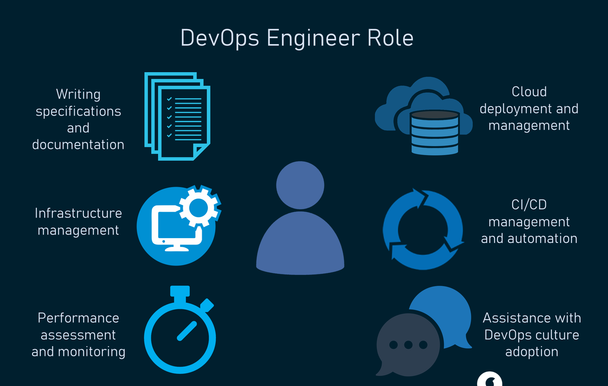
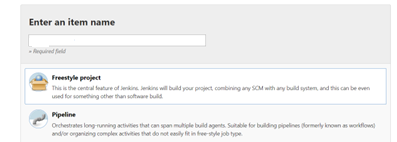

# DevOps 30/05/22
## What is DevOps?
- DevOps is a set of practices and cultural philosophy that removes the barriers between traditionally siloed teams that are the development and operations teams. Under a DevOps model, development and operations teams work together across the entire software application life cycle, from development and test through deployment to operations. 

- DevOps enabled developers and operations team to accelerate delivery through automation, collaboration, fast feedback and iterative improvement. It facilitates a culture of collaboration and share responsibility.

## Why DevOps? What are its benefits?
- Before DevOps, Development teams and operations team were working in silos so they blame each other whenver there is a problem. DevOps removes the barrier between the silos and help better understandings between the development team and operations team.

- Speed - DevOps practices let you move at the velocity you need to innovate faster, adapt to changing markets better, and become more efficient at driving business results
- Rapid delivery - When you increase the pace of releases, you can improve your product faster and build competitive advantage.
- Reliability - DevOps practices like continuous integration and continuous delivery can ensure the quality of application updates and infrastructure changes so you can reliably deliver at a more rapid pace while maintaining an optimum experience for end users.
- Improved collaboration - Under a DevOps model, developers and operations teams collaborate closely, share responsibilities, and combine their workflows. This reduces inefficiencies and saves time.
- Security - Adopt a DevOps model without sacrificing security by using automated, integrated security testing tools.

## Role of DevOps?
- DevOps has been created to bridge the gap between software development teams and IT operations. The DevOps Engineer serves an important role on each team and liaises between them
- A DevOps engineer is someone with a deep knowledge of the software development process and lifecycle and has expertise in the various automation tools for developing CI/CD pipelines.

- The DevOps engineer  works with developers and IT teams to monitor and facilitate code releases on a CI/CD basis.
- The DevOps Engineer work with internal customers, including QC personnel, software and application developers, project managers, project stakeholders

## What are the four pillars of DevOps?
- Robustness - By working together, the IT infrastructure are more robust as there is better collaboration.

- Flexibility - able to work across different programming language and cloud platforms
- Cost effective -faster release of software, less errors due to CI/CD, less manual work due to automation
- East of use - easy to apply DevOps to any work environment.

#
# What is development environment? 
- A development environment is a collection of procedures and tools for developing, testing and debugging an application or program. The development environment normally has three server tiers, called development, staging and production. All three tiers together are usually referred to as the DSP. 

- Development server - The development server is used to test the code and conduct application performance checks. Once successfully tested, the developer moves the application to the staging server.

- Staging server - The staging server looks exactly like the production server environment. Using a staging server enables developers to run tests on the staging server to ensure reliability and avert failure in an actual production server. Running tests on the staging server is usually the final step before deploying the application to a production server.

- Production(Live) server - A production server or live server is used to host website content and applications for deployment to a live environment. Once the application is approved, it becomes part of the production server.

## Why is it needed?
- The purpose of a development environment is to have a place for a developer to test anything they want without worrying about it affecting any end-users or content editors working on a live website.You should use a development environment if you want to make sure not to break anything on your live environments that your users see. By using a development environment for your website, you'll have a place to make all of the changes you want, without the users of your website will notice.

- Working with multiple environments and following a deployment process is great for streamlined workflows and for reducing potential errors. It also means that a developer can make breaking changes on the development environment and make sure everything works before deploying the changes to a live environment. A development environment is often hosted locally by the developer, but can also be hosted on a server.
 
- It might look like an unnecessary step to have more than a live environment, but even with very small projects, it's becoming the industry standard and a workflow that most developers prefer. And with the help of integrated development environments and powerful deployment technology, it rarely adds much extra development time. 

- On the contrary, it might help speed up the development process as the developer has more freedom during development, as they don't have to worry about breaking the site. This gets changes implemented faster and safer than if it all had to be done in a live environment.
#
# Linux commands
### List of linux commands:
- Establish an SSH session into Ubuntu `vagrant ssh`
- Update Ubuntu `sudo apt-get update -y`

- Upgrade Ubuntu `sudo apt-get upgrade -y`
- Install nginx `sudo apt-get install nginx -y`
- check nginx status `systemctl status nginx` or `start` or `stop` or `restart`
- creates and configures guest machines according
to your vagrantfile `vagrant up`
- destroy vagrantfile `vagrant destroy`
- exit out of nginx `exit`

 #sudo stands for superuser do and execute command as root privilege.
#
 ### Bash scripting:
 - create a file called provision.sh
 - change permission of file `chmod +x provision.sh`
 - First line MUST BE `#!/bin/bash
 - Update and upgrade
 - Installed nginx
 - Start nginx
 - `enable nginx`
 - stopped then started
 - To run our script `sudo ./provision.sh`
 #
 ## Configure Vagrant
 ### In the vagrantfile add these codes.
 - `Vagrant.configure("2") do |config|`
 
 - `config.vm.box = "ubuntu/xenial64" `
 - `#add a private network between localhost and VM using ip`
 - `config.vm.network "private_network", ip: "192.168.10.100" `
 - `#add ext script to run vagrant`
 - `config.vm.provision "shell", path: "./provision.sh", run: "always" `

 ### Sync app folder to virtualbox.
 - `# Synced app folder`
 - `# cp everything from current location create a folder called app - copy everything from localhost `
 - `config.vm.synced_folder ".", "/home/vagrant/app" `
 #
 ## Provisioning Vagrant
### In the VirtualBox:
### create a provision.sh file. Add this code in the file.
- `#!bin/bash `

- `#update sudo apt-get update -y`

- `#upgrade sudo apt-get upgrade -y`

- `#install nginx sudo apt-get install nginx`

- `#start nginx sudo systemctl start nginx`

- `#enable nginx sudo systemctl enable nginx`

### In the local host:
-  `gem install bundler`
-  `bundler`
- run `rake spec` . Test will fail first time.
- Install nodejs v6 using `sudo curl -sL https://deb.nodesource.com/setup_6.x | bash -`
- `sudo apt-get install nodejs -y`
- install `pm2`
- `rake spec` again to check if tests passed. Once all tests are passed, follow the next step below.
- open vagrantfile and add this code `config.vm.synced_folder ".", "/home/vagrant/app"` to sync app folder. This copy everything from current location create a folder called app - copy everything from localhost. Save the file

- Do `vagrant reload` after this

###  In the VirtualBox again:

-  `vagrant ssh` into VirtualBox
- `npm install`
- `npm start`
- Your app is now ready and listening on port 3000
enter :3000 after the host address 192.168.10.100

### To automate without SSH into VirtualBox
- In the your local folder, add these commands into the provision.sh file.

- `#download v6 curl -sL https://deb.nodesource.com/setup_6.x | sudo -E bash -`

- `#install nodejs sudo apt-get install nodejs -y`

- `#install pm2 sudo npm install pm2 -g`

- `#download python stuff sudo apt-get install python-software-properties`

- `#redirect to app folder cd /app/app/app/`

- `#npm install and d to detach npm install -d`

- `#start npm npm start`

- Do `vagrant reload`

- Enter your IP adress including port 3000 (192.168.10.100:3000) on your browser. You will now see the Spartan App page if it is working correctly.
#

## Reverse Proxy
- `location / {
    proxy_pass http://localhost:3000;
    proxy_http_version 1.1;
    proxy_set_header Upgrade $http_upgrade;
    proxy_set_header Connection 'upgrade';
    proxy_set_header Host $host;
    proxy_cache_bypass $http_upgrade;
}`
#
## What is Cloud computing
- Cloud computing is the on-demand delivery of IT resources over the Internet with pay-as-you-go pricing. Instead of buying, owning, and maintaining physical data centers and servers, you can access technology services, such as computing power, storage, and databases, on an as-needed basis from a cloud provider like Amazon Web Services (AWS).

- Types of cloud computing:
- Infrastructure as a Service (IaaS) - IaaS contains the basic building blocks for cloud IT. It typically provides access to networking features, computers (virtual or on dedicated hardware), and data storage space. IaaS gives you the highest level of flexibility and management control over your IT resources. It is most similar to the existing IT resources with which many IT departments and developers are familiar

- Platform as a Service (PaaS) - PaaS removes the need for you to manage underlying infrastructure (usually hardware and operating systems), and allows you to focus on the deployment and management of your applications. This helps you be more efficient as you don’t need to worry about resource procurement, capacity planning, software maintenance, patching, or any of the other undifferentiated heavy lifting involved in running your application. 

- Software as a Service (SaaS) - SaaS provides you with a complete product that is run and managed by the service provider. In most cases, people referring to SaaS are referring to end-user applications (such as web-based email). With a SaaS offering, you don’t have to think about how the service is maintained or how the underlying infrastructure is managed. You only need to think about how you will use that particular software. 

## Benefits of cloud computing

- Trade fixed expense for variable expense – Instead of having to invest heavily in data centers and servers before you know how you’re going to use them, you can pay only when you consume computing resources, and pay only for how much you consume.

- Benefit from massive economies of scale – By using cloud computing, you can achieve a lower variable cost than you can get on your own. Because usage from hundreds of thousands of customers is aggregated in the cloud, providers such as AWS can achieve higher economies of scale, which translates into lower pay as-you-go prices.

- Stop guessing capacity – Eliminate guessing on your infrastructure capacity needs. When you make a capacity decision prior to deploying an application, you often end up either sitting on expensive idle resources or dealing with limited capacity. With cloud computing, these problems go away. You can access as much or as little capacity as you need, and scale up and down as required with only a few minutes’ notice.

- Increase speed and agility – In a cloud computing environment, new IT resources are only a click away, which means that you reduce the time to make those resources available to your developers from weeks to just minutes. This results in a dramatic increase in agility for the organization, since the cost and time it takes to experiment and develop is significantly lower.

- Stop spending money running and maintaining data centers – Focus on projects that differentiate your business, not the infrastructure. Cloud computing lets you focus on your own customers, rather than on the heavy lifting of racking, stacking, and powering servers.

- Go global in minutes – Easily deploy your application in multiple regions around the world with just a few clicks. This means you can provide lower latency and a better experience for your customers at minimal cost.

## How does cloud computing fit into DevOps?

- DevOps automation is becoming cloud-centric. Most public and private cloud computing providers support DevOps systemically on their platform, including continuous integration and continuous development tools. This tight integration lowers the cost associated with on-premises DevOps automation technology, and provides centralized governance and control for a sound DevOps process. Many developers who enter into the process find that governance keeps them out of trouble, and it's easier to control this centrally via the cloud versus attempting to bring departments under control.

- Cloud-based DevOps lessens the need to account for resources leveraged. Clouds leverage usage-based accounting, which tracks the use of resources by application, developer, user, data, etc. Traditional systems typically don't provide this service. When leveraging cloud-based resources, it's much easier to track costs of development resources and make adjustment as needed.
#
## What is AWS? 

- Amazon Web Services (AWS) is the world’s most comprehensive and broadly adopted cloud platform, offering over 200 fully featured services from data centers globally. - Millions of customers—including the fastest-growing startups, largest enterprises, and leading government agencies—are using AWS to lower costs, become more agile, and innovate faster.

### AWS best practices - naming convention
- eng114_yourname_app
- eng114_yourname_db
eng114_yourname_bastion

## Two tier architecture in AWS

#
## MongoDB setup on AWS

### creating EC2 instances 

- Before using EC2, plan, design, develop

- click launch instances (not from template)

- choose OS - Ubuntu 18.04

- choose t2.micro

- add storage

- choose network (VPC, subnets)

- add tags

- add security group

- create or choose existing key

- review and launch

- to automate running your python script, you can add it in user data under step 3 - configuring instance.

### creating AMIs

- select AMI from the left panel of console

- lauch instance from  AMI

- follow similar steps to creating instance
- create AMI

### User data script for automation
- Script for app instance
- #!/bin/bash

- #Update and upgrade 
`sudo apt-get update -y`
`sudo apt-get upgrade -y`

- #Install nginx
`sudo apt-get install nginx -y`
`sudo systemctl start nginx`
`sudo systemctl enable nginx`

- #Install nodejs and npm
`curl -sL https://deb.nodesource.com/setup_6.x | sudo -E bash -`
`sudo apt-get install nodejs -y`
`sudo apt-get install npm `
`sudo npm install pm2 -g`
`sudo apt-get install python-software-properties -y`

- #Copy data from GitHub repo to AWS
`mkdir repo`
`cd repo`
`git clone https://github.com/BA-cybersec/eng114_devops.git`
`cd eng114_devops/`

- #Copy default file to allow to forward from port 3000 to port 80 
`sudo mv default /etc/nginx/sites-available/default` 

- #Restart nginx
`sudo systemctl restart nginx`

- #Make environment variable DB_HOST so that our app can connect to the database through port 27017
`sudo echo "export DB_HOST='mongodb://public ip of your DB:27017/posts'" >> /etc/bash.bashrc`
`source /etc/bash.bashrc`

- ##install npm
`sudo apt npm install`

#
## Amazon S3
- can store any type of data
- No data limit
- highly available
- global service
- scalable
- Storage class:
- Standard - frequent access. Data readily accessible.
- Glacier - infrequent access. Takes time to access data. For archiving data
## How to configure into aws
- `aws configure`
- enter access key
- enter sercet key
- enter region `eu-west-1`
- enter language `json`
## Install aws command line
- `sudo pip3 install awscli`
## install python 3.7
- `sudo apt-get update`
- `sudo apt-get install build-essential libpq-dev libssl-dev openssl libffi-dev zlib1g-dev`
- `sudo apt-get install python3-pip python3.7-dev`
- `sudo apt-get install python3.7`
- if getting error, do this
- `sudo apt-get install -y software-properties-common`
- `sudo add-apt-repository ppa:deadsnakes/ppa`
- `sudo apt-get update`
- `sudo apt-get install python3-pip python3.7-dev`
- `sudo apt-get install python3.7`
- `sudo update-alternatives --install /usr/bin/python3 python3 /usr/bin/python3.7 2`
- `sudo update-alternatives --config python3`
- If getting dkpg error
- sudo apt update
- sudo apt upgrade
- sudo apt install python3.7
- do alias python=python3
- If getting boto3 no moduleerror:
- do pip uninstall boto3
- sudo pip install --target=/usr/lib/python3.6/dist-packages boto3
## install boto3
- `pip install boto3`
## Create bucket
- `import boto3`

`s3 = boto3.client('s3')`

`s3.create_bucket(Bucket='name of your bucket', CreateBucketConfiguration={`

    `'LocationConstraint': 'eu-west-1'})`
## upload file to s3 bucket
- `import boto3`

`s3 = boto3.client('s3')`

`s3.upload_file(`
`Filename = 'test1.txt',`
`Bucket = 'name of your bucket',`
`Key = 'test1.txt'
`)`

## download file from s3 bucket
- `import boto3`

`s3 = boto3.client("s3")`

`s3.download_file(`

    `Bucket="name of bucket", Key="test1.txt", Filename="test1.txt"`
## delete file from s3 bucket
- `import boto3`

`s3 = boto3.resource('s3')`

`s3.Object('name of your bucket', 'test1.txt').delete()`

## delete s3 bucket
- `import boto3`

`s3 = boto3.client("s3")`

`bucket_name = "name of your bucket"`

`client.delete_bucket(Bucket=bucket_name)`
#

# Monitoring and alert management

- Questions to ask -
- What should we monitor?
- number of users-network
- CPU utilisation
- memory availability
- Status 200- API to check health status of the instance
- When should we monitor?
- Who should be responsible?
- What should be the next steps?
- Why should we monitor?
- What aspects shoulf we monitor?
- error logs
- budgeting
- uptime-access time-response time
- security breaches
- system tests/health
- instance's health
#
## CloudWatch for monitoring and its use with other AWS services:

- Amazon CloudWatch monitors your Amazon Web Services (AWS) resources and the applications you run on AWS in real time. You can use CloudWatch to collect and track metrics, which are variables you can measure for your resources and applications.

- The CloudWatch home page automatically displays metrics about every AWS service you use. You can additionally create custom dashboards to display metrics about your custom applications, and display custom collections of metrics that you choose.

- You can create alarms that watch metrics and send notifications or automatically make changes to the resources you are monitoring when a threshold is breached.
#

### Amazon SNS to send notification or alarms to customers:

- Amazon Simple Notification Service (Amazon SNS) is a managed service that provides message delivery from publishers to subscribers. Publishers communicate asynchronously with subscribers by sending messages to a topic, which is a logical access point and communication channel. 

- Clients can subscribe to the SNS topic and receive published messages using a supported endpoint type, such as Amazon Kinesis Data Firehose, Amazon SQS, AWS Lambda, HTTP, email, mobile push notifications, and mobile text messages (SMS).

#
## Setup for monitoring and alert management:

- Enable detailed monitoring 

### create alarm

- create alarm in CloudWatch
- select metrics -> EC2 -> per instance metrics
- select percentage 50
- create dashboard

- go to simple notification service (sns)
### create topic
- type standard
- Name your topic
- then click on create topic
### create subscription
- choose topic you want to use
- choose protocol - email
- choose endpoint - subscribe using your email
- then create subscription

## Autoscaling and load balancing

### Application Load Balancer

- Autoscaling automatically adjusts the amount of computational rescources based on the server load

- Load Balancing distributes traffic between EC2 instances so that no one instance gets overwhelmed
- Launch template
- Type of LB -ALB Application Load Balancer: target group/listener group HTTP
- ALB -attach required dependencies
- Auto scaling group - attach this to ALB
### Create launch template for use auto scaling group

- click on launch template under instances on left panel of console

- click on create launch template
- name your template
- check box for provide autoscaling guidance
- Add tags under template tags: Key = Name, Value = eng114-name-asg-lt
- Choose Ubuntu 18.04 as amis
- Instance type as t2.micro
- choose key pair
- Choose subnets - eu-west-1a, 1b and 1c
- choose app security group
- add script in user data if needed for example
- `sudo apt-get update`
- `sudo apt-get upgrade`
- `sudo apt-get install nginx`
- `sudo systemctl start nginx`
- `sudo systemctl enable nginx`
- click again on create launch template
### Auto scaling group

- create auto scaling group
- Name your auto scaling group
- choose your launch template
- Choose availability zone and subnets - eu-west-1a, 1b and 1c
- attach load balancer
- type as application load balancer 
- name load balancer
- load balancer scheme - internet facing
- create target group 
- name target group

- target tracking scaling policy 

- target value = 20 or 50 during production 
- scaling policies - none
- Choose group size - desired capacity = 2, minimum capacity = 2, maximum capacity = 3

- create load balancer target group
### Connect or configure Amazon SNS notification to auto scaling group using AWS cli

- run this command:
- `aws autoscaling put-notification-configuration --auto-scaling-group-name my-asg --topic-arn arn --notification-types "autoscaling:EC2_INSTANCE_LAUNCH" "autoscaling:EC2_INSTANCE_TERMINATE"`
- aws autoscaling put-notification-configuration --auto-scaling-group-name my-asg --topic-arn arn --notification-types "autoscaling:EC2_INSTANCE_LAUNCH" "autoscaling:EC2_INSTANCE_TERMINATE"
- script for autoscaling group
- `#!/bin/bash`
`n=1`
`while [ true ]`
`do `
   ` echo "Increase load on our server x${n}"`
   ` n=$(( n+1 ))`
`done`
### to find DNS of autoscaling group, 
- click on load balancer on left panel of console.
- select your application load balancer (ALB). Scroll down and under description you will find DNS of your autoscaling group.
#

## Four golden signals for monitoring

 
- latency - Latency is the time it takes to send a request and receive a response. Latency is commonly measured from the server side but can also be measured from the client side to account for differences in network speed.

- traffic - Traffic is a measure of the number of requests flowing across the network. These may be HTTP requests to your web server or API, or messages sent to a processing queue. Times of peak traffic can result in additional stress on your infrastructure and may push it to the limit, triggering downstream effects
- Errors - Errors can tell you about misconfigurations in your infrastructure, bugs in your application code, or broken dependencies. For example, a spike in error rate could indicate the failure of a database or network outage
- Saturation - Saturation defines the load on your network and server resources. Every resource has a limit after which performance will degrade or become unavailable. 

We resolved a problem with single point of failure
- performance testing
- load testing
- stress testing
- spike testing
- SOAP testing

## What is a VPC?

- A virtual private cloud (VPC) is a secure, isolated private cloud hosted within a public cloud. Essentially, a VPC provisions logically isolated sections of a public cloud in order to provide a virtual private environment.

### Why do we use it?

- Amazon VPC enables you to build a virtual network in the AWS cloud - no VPNs, hardware, or physical datacenters required. You can define your own network space, and control how your network and the Amazon EC2 resources inside your network are exposed to the Internet. You can also leverage the enhanced security options in Amazon VPC to provide more granular access to and from the Amazon EC2 instances in your virtual network.

### What are  the benefits of VPC?
- Scalability: Because a VPC is hosted by a public cloud provider, customers can add more computing resources on demand.

- Easy hybrid cloud deployment: It's relatively simple to connect a VPC to a public cloud or to on-premises infrastructure via the VPN. (Learn about hybrid clouds and their advantages.)

- Better performance: Cloud-hosted websites and applications typically perform better than those hosted on local on-premises servers.

- Better security: The public cloud providers that offer VPCs often have more resources for updating and maintaining the infrastructure, especially for small and mid-market businesses. For large enterprises or any companies that face extremely tight data security regulations, this is less of an advantage.
#

## What is internet gateway?
- An internet gateway is a horizontally scaled, redundant, and highly available VPC component that allows communication between your VPC and the internet. 
- An internet gateway enables resources (like EC2 instances) in your public subnets to connect to the internet if the resource has a public IPv4 address or an IPv6 address. Similarly, resources on the internet can initiate a connection to resources in your subnet using the public IPv4 address or IPv6 address. For example, an internet gateway enables you to connect to an EC2 instance in AWS using your local computer.

- An internet gateway serves two purposes: to provide a target in your VPC route tables for internet-routable traffic, and to perform network address translation (NAT) for instances that have been assigned public IPv4 addresses. 
#
## What is a subnet?
- A subnet, or subnetwork, is a network inside a network. Subnets make networks more efficient. Through subnetting, network traffic can travel a shorter distance without passing through unnecessary routers to reach its destination
#
## What is CIDR block?
- Classless inter-domain routing (CIDR) is a set of Internet protocol (IP) standards that is used to create unique identifiers for networks and individual devices. The IP addresses allow particular information packets to be sent to specific computers. CIDR is based on the idea of subnet masks
- CIDR IP addresses consist of two groups of numbers, which are also referred to as groups of bits. The most important of these groups is the network address, and it is used to identify a network or a sub-network (subnet). 
- The lesser of the bit groups is the host identifier. The host identifier is used to determine which host or device on the network should receive incoming information packets. 
- In contrast to classful routing, which categorizes addresses into one of three blocks, CIDR allows for blocks of IP addresses to be allocated to Internet service providers. The blocks are then split up and assigned to the provider’s customers. Until recently, IP addresses used the IPv4 CIDR standard, but because IPv4 addresses are nearly exhausted, a new standard known as IPv6 has been developed and will soon be implemented.

- The ability to group blocks of addresses into a single routing network is the hallmark of CIDR, and the prefix standard used for interpreting IP addresses makes this possible. CIDR blocks share the first part of the bit sequence that comprises the binary representation of the IP address, and blocks are identified using the same decimal-dot CIDR notation system that is used for IPv4 addresses. 
### How to create CIDR block?

 
- The CIDR notation consists of an IP address, a slash character (‘/’) and a decimal number from 0 to 32. Using this notation we take the IP address and we split it into two blocks of bits: the most significant bits, the network prefix represents the network, and the second block identifies the host in that network. The number after the slash character (the subnet masks) tells us how many bits we need to take for the network prefix. 

- For example, let’s see 192.168.0.0/24:

  IP Address: 192.168.0.0

   Subnet Mask: 255.255.255.0

   11000000 10101000 00000000 00000000

   11111111   11111111   00000000 00000000

- In this example, we use 24 bits for the network representation and the remaining 8 bits to identify hosts within this network. This means we’ve got 28 = 256 possible IP addresses for our hosts. In other words, we are sizing our network to 256 hosts. 
#
## What is NACLS?

 
- A network ACL (or NACL) controls traffic to or from a subnet according to a set of inbound and outbound rules. This means it represents network level security or NACL operate at a subnet level. For example, an inbound rule might deny incoming traffic from a range of IP addresses, while an outbound rule might allow all traffic to leave the subnet.

- Because NACLs function at the subnet level of a VPC, each NACL can be applied to one or more subnets, but each subnet is required to be associated with one—and only one—NACL.

- NACLs are stateless - response traffic is subject to inbound and outbound rules.

- Use cases:
- For example if you wanted to remove a user's SSH access. In this case you have two choices — 1) Remove SSH inbound allow rule of that user in the Security Group Inbound Rule. 2) Add an NACL Rule explicitly denying traffic from their IP address. If you go with the first one, they would not lose thier SSH connection, this is due to the connection tracking behavior of Security Groups. If you go with the latter choice, NACL would immediately block his Connection. So in this case, it’s better to use a NACL Deny Rule rather than deleting a Security Group allow Rule.

NACls work on a subnet level. Security group work on a instance level.
#
# VPC

- Step 1: Create a VPC in Ireland eu-west-1

- Step 2: Create Internet Gateway.
- Step 2.1: attach the internet gateway with your VPC
- Step 3: create a subnet/s - associate subnet with your VPC.
- Step 4: create a route table within your VPC
- Step 4.1 edit route table to add rules to connect to Internet Gateway(IG)
- step 4.2 associate route table with subnet
- VPC submask = 10.0.0.0/16
- Subnet = 10.0.1.0/24
- My public subnet = 10.0.3.0/24
#
## Redeployment of two tier architecture

- step 1 - create your instance for app using your app ami
- step 2 - when creating instance for app choose your VPC you made earlier and choose the public subnet you made earlier
-  step 3 - For security group, allow SSH for port 22 to your IP and HTTP for port 80
- step 4 - create another subnet for db. This would be private subnet. The CIDR block for this subnet would be 10.0.14.0/24. Associate this subnet with your VPC you made earlier.

- step 5  - create a db instance using your db ami. 
- step 6 - when creating instance for db choose your VPC and choose private subnet as your subnet.
-  step 7 - disable auto assign public ip
- step 8 - For security group, allow SSH for port 22 to your IP and port 27017 for app ip.
- step 9 ssh into your app instance
- step 10 `cd /etc`
- step 11 `chmod 777 bash.bashrc`
- step 12 `sudo echo "export DB_HOST=mongodb://your_private_db_ip:27017/posts" >> bash.bashrc`
- step 13 `source bash.bashrc`
- step 14 `npm start`
#
## CI/CD

### What is Continuous Integration?
-  Continuous Integration  means that the developer's working copies on local are synch with a shared master branch several times a day.

### What is the difference between CD and CDE - use cases?

- Continuous Delivery is an extension of continuous integration to make sure that you can release new changes to your customers quickly in a sustainable way. This means that on top of having automated your testing, you also have automated your release process and you can deploy your application at any point of time by clicking on a button. In continuous Delivery the deployment is completed manually.

- So in essence, Continuous Delivery is described as the logical evolution of continuous integration which is to always be able to put a product into production.

- Continuous Deployment goes one step further than continuous delivery, with this practice, every change that passes all stages of your production pipeline is released to your customers, there is no human intervention, and only a failed test will prevent a new change to be deployed to production

- So in essence, Continuous Deployment is described as the logical next step after continuous delivery which is to automatically deploy the production into production whenever it passes QA

### What is Jenkins?

- Jenkins is an open-source automation server in which the central build and CI process take place. It is a Java-based program with packages for Windows, macOS, & Linux

### What are the benefits of CICD pipeline?
- Finding and fixing bugs late in the development process is expensive and time-consuming. This is especially true when there are issues with features that have already been released to production. With a CI/CD pipeline, you can test and deploy code more frequently, giving testers the ability to detect issues as soon as they occur and to fix them immediately. You are essentially mitigating risks in real time.

- Organizations are moving toward releasing features multiple times a day. This is not an easy task but with a seamless CI/CD pipeline, multiple daily releases can be made a reality. Teams can build, test and deploy features automatically with almost no manual intervention. 

- another benefits of a CI/CD pipeline is you can roll back changes quickly. If any new code changes break the production application, you can immediately return the application to its previous state. Usually, the last successful build gets immediately deployed to prevent production outages. The world is moving toward rapid release cycles, and CI/CD pipelines have accelerated the release rate. With careful planning and implementation, such a pipeline can help find defects faster, implement fixes immediately, and increase overall customer satisfaction

### What are the other tools available for CICD pipleline?

- Other tools available are circleci, TeamCity, Bamboo and GitLab

### Why Jenkins?

- With great range of plugins available, Jenkins supports building, deploying, and automating for software development projects, easy installation, simple and user-friendly interface, extensible with huge community-contributed plugin resource, easy environment configuration in user interface & supports distributed builds with master-slave architecture

- When to use or not use Jenkins? - Cost benefit analysis
- increments. functionality being built.

#
### CICD with Jenkins

- If test pass, master node received the response and push to github
You need to make sure master node doesn’t break. Master node is t2.medium. Agent node is t2.micro
#

SSH a connection between GitHub 
- generate ssh key pair on localhost in the .ssh folder
using this command below
- `ssh-keygen -t rsa -b 4096 -C "your_email@example.com"`
- `cd .ssh` and do `ls`
- you will find two key files of same name - one with .pub
- cat the .pub key and copy the whole script. It will look like ssh-rsa xahdkajustaexample.
- go to your GitHub repo and go to settings
- go to deploy key and copy the pub key to our GitHub using the add deploy key tab

- go to code tab, click the ssh tab and copy your repo link

- go to git bash and `git clone repo-link`
- If you get repo exist problem then make a new folder and git clone in that folder.
- If you get permission denied error then use this command to so that key is attached to your account:
- `eval "$(ssh-agent -s)"`
- `ssh-add ~/.ssh/your_key_name`

- do `ls` and you will see the app folder which we will need later

- test the SSH connection by editing readme.md. 
- `git add`, ` git commit -m` and `git push -u origin main` readme.md to github

- If test works, you will see change in your readme.md in your GitHub
#
### Creating jobs in Jenkins
- env testing for jenkins
- date 

- click on new item
- enter name
- click on freestyle project
- click ok

- add description

- check discard old builds and keep max number of builds to 3

- go further down to build section and click on execute
shell

- add this command in the box: `uname -a`

- go down to post-build actions section and click on trigger only if build is stable
- save job

- click on build now on left panel and now your job has been created.
- If job is successful = blue, failed = red, cloud if 50/50

- build a second job for checking zone. Following the same step as above but use `date` for the command

- click on console output to see if your job is successful and see more details on output.

### Second iteration job

- create a new job

- before doing this, git clone app folder.

- Copy app folder and environment folder to my local host where the github repo is
- Git add ., Git commit, Git push to my repo
 

- this time, check GitHub project and enter the http of your GitHub repo in project url

- go down to office 365 connector section and check restrict where this project can be run. 
- Enter agent node on label expression.

- Go down to source code management. Click on git and enter the repo url of ssh
- enter your credentials by choosing from the scroll bar. Click add to add your private key you copied when you `cat` your private key 

- enter main for branches to build
- go down to build environment section and check provide node and npm bin/folder to PATH
- go to build and choose execute shell
- enter this script
- `cd app` `npm install` `npm test`

#
### Create a webhook and implementing it to the job

- To create a webhook, go to settings on your GitHub repo
- click on webhook on left panel

- click add webhook
- add your jenkins url/githug-webhook/ on payload url. Choose application/json on content type

- choose let me individual events and check pushes. Check active as well.
- Now we need to make it so that webhook connects to Jenkins
- Go back to Jenkins and configure your job.
- go to build trigger section and check GitHub hook trigger for GITScm polling
- To test it, make changes to your readme.md and push it to GitHub. If it works, then you will see a new build being created automatically and you can see the commit and push you made on the change section of the build.
#
### Create a second iteration using dev branch

- create a second job
- do same step as before however this time:
- Create a dev branch on local host using git bash

- `git branch dev`
- change to dev
- `git checkout dev`
- Go back to Jenkins
- configure the job
- go to source code management and change branch to build from main to dev
- 
- go down to post-build actions
- check push only if build succeeds
- check merge result
- click on branches and enter main for branches to push and enter origin for target remote name
- Back on git bash,
- edit readme.md
- git add ., commit and push to GitHub
- Go back to Jenkins. If test is successful, you will see a new build and you will see any changes you made to your readme.md in your main and dev branch. This means that whatever you push from your dev branch to jenkins have now been pushed to your main branch or your dev and main branch merge if test pass.
#
### How to copy files from Jenkins to EC2
- use the command below:
- `rsync -avz -e "ssh -o StrictHostKeyChecking=no" location of app folder ubuntu@ipaddress:ubuntu/`
#
### Using script to automate app to EC2
- `rsync -avz -e "ssh -o StrictHostKeyChecking=no" location of app folder ubuntu@ipaddress:ubuntu/`
- `rsync -avz -e "ssh -o StrictHostKeyChecking=no" name of provision file for app ubuntu@ipaddress:ubuntu/`
- `rsync -avz -e "ssh -o StrictHostKeyChecking=no" default ubuntu@ipaddress:ubuntu/`
- `ssh -A -o "StrictHostKeyChecking=no" ubuntu@ipaddress <<EOF`
- `cd ubuntu`

- `sudo chmod +x name of provision file for app`
- `./name of provision file for app`
- Note: EOF is used when switching from Jenkins server to EC2
#
### How to create Jenkins server using EC2 instance
- Launch an EC2 instance that is using Ubuntu 18.4
- SSH into your instance and do update and upgrade

- install java using the following commands below:
- `sudo apt update`
- `java -version`
- ` sudo apt install default-jre`
- `sudo apt install default-jdk`
- `javac -version`
- install Jenkins using the following commands below:
- `wget -q -O - https://pkg.jenkins.io/debian-stable/jenkins.io.key | sudo apt-key add -`
- `sudo sh -c 'echo deb http://pkg.jenkins.io/debian-stable binary/ > /etc/apt/sources.list.d/jenkins.list'`
- `sudo apt update`
- `sudo apt install jenkins`
- start Jenkins
- `sudo systemctl start jenkins`
- `sudo systemctl status jenkins`
- open firewall to allow Jenkins by opening port 8080:
- `sudo ufw allow 8080`
- `sudo ufw status`
- Set up Jenkins using below command:
- `sudo cat /var/lib/jenkins/secrets/initialAdminPassword`
- To build our NodeJS app, we need to configure Jenkins
- To do this, click on manage Jenkins and then manage plugins in the Jenkins dashboard
- Install NodeJS and SSH agent
- CLick on the Global Tool Configuration tab and scroll down to NodeJS. click Add NodeJS and then name your NodeJS installation. lastly, to allow us to build app on the Jenkins server for testing, select version 13.3.0 
#
## Infrastructure as Code (IaC)
### What is IaC?
- Infrastructure as Code (IaC) is the managing and provisioning of infrastructure through code instead of through manual processes.

- With IaC, configuration files are created that contain your infrastructure specifications, which makes it easier to edit and distribute configurations. It also ensures that you provision the same environment every time. 
- By codifying and documenting your configuration specifications, IaC aids configuration management and helps you to avoid undocumented, ad-hoc configuration changes.
### What are the benefits of IaC?
- Improved productivity: Administrators and operators no longer must perform manual configuration steps for data center infrastructure changes.

- Consistency: IaC can improve consistency and reduce errors that often happen during manual configuration. It also eliminates any configuration drift that might occur during a manual process. By codifying and documenting your configuration specifications, IaC helps you avoid undocumented, ad-hoc configuration changes.

- Efficiency: Codifying your infrastructure gives you a template for provisioning, which simplifies system configuration, maintenance and management. It creates an elastic infrastructure that is repeatable and scalable. This means that DevOps can accelerate every step of software development, leading to more applications being released on a daily basis.
- Speed: IaC transforms developers’ time-consuming provisioning work into a simple script execution to have their infrastructure ready. As a result, application deployments no longer have to wait for the infrastructure and new software can be released much more quickly.
- Risk reduction: IaC also champions version control so your configuration files can fall under source control just like any other software source code file. In this way, risk is reduced.
### What are the IaC tools that are available?
- Terraform

- AWS CloudFormation(Other cloud platform also have their own IaC tools)
- Vagrant
### What is configuration management and orchestration under IaC?
- Configuration Management: CM involves maintaining consistency (performance, physical and functional attributes, etc.) with original design

- Configuration Orchestration: CO is the process of automating the provision of infrastructure with IaC
#
### What is Ansible?
- is an open sourceIT automation tool that automates provisioning, configuration management, application deployment, orchestration, and many other manual IT processes. 

- Unlike more simplistic management tools, Ansible users (like system administrators, developers and architects) can use Ansible automation to install software, automate daily tasks, provision infrastructure, improve security and compliance, patch systems, and share automation across the entire organization.
### What are the benefits of Ansible?
- Very simple to set up and use: No special coding skills are necessary to use Ansible’s playbooks (more on playbooks later)and is supported by YAML.
- Powerful: Ansible lets you model even highly complex IT workflows. 
- Secure and consistent: Since the Ansible uses SSH and Python it is very secure and the operations are flawless.

- Performance: The Ansible’s performance is excellent and has very little latency.
- Flexible: You can orchestrate the entire application environment no matter where it’s deployed. You can also customize it based on your needs.
- Agentless: You don’t need to install any other software or firewall ports on the client systems you want to automate. You also don’t have to set up a separate management structure. The connection can be done through the SSH or using the Python.
- Efficient: Because you don’t need to install any extra software, there’s more room for application resources on your server.
- Low Overhead: As it is agentless and does not require any servers, daemons, or databases it can provide a lot of space in the systems and has low overhead in terms of deployment.
### How does Ansible, Terraform and IaC fit into Devops?
- DevOps requires creating, updating and changing infrastructure for various environments(development, testing, staging, live)

- These environments are constantly changing so DevOps uses these tools and concepts in order to quickly work with and automate the provisioning of cloud-based infrastructure
- Ansible is the most preferred DevOps tool for orchestration, automation, configuration, and managing the IT Infrastructure. 
- Ansible provides support for integrating development and operations in contemporary test-driven application design. It provides a stable environment for the development and operations team, thereby leading to smooth orchestration. Ansible automation helps considerably with the representation of Infrastructure as Code (IAC).
- The benefits of Ansible in DevOps is to respond and scale in pace with the demand. Other benefits of ansible in DevOps is the feedback loop is accelerated at a faster rate. The bugs are found sooner and not wait till the end. Risk due to lack of sufficient knowledge is mitigated. The deployments are reliable. The IT infrastructure is coordinated. The deployments are faster. 
- With the infrastructure setup written as code, it can go through the same version control, automated testing and other steps of a continuous integration and continuous delivery (CI/CD) pipeline that developers use for application code. 
- An organisation may choose to combine infrastructure as code with containers, which abstract the application from the infrastructure at the operating system level. Because the OS and hardware infrastructure are provisioned automatically and the application is encapsulated atop it, these technologies prove complementary for diverse deployment targets, such as test, staging and production.
- 
### How does this benefit businesses?
- Time is saved

- Costs are reduced

- Quality and consistency increase

- Product environments can quickly change and adapt

- Products and product changes are delivered quickly to customers